These are the steps I typically take to set up a fresh M365 E5 tenant. This is not complete. I'm documenting this (finally) as I rebuild a new test tenant.

## Azure AD

### Azure AD Connect

Assuming you already have a Lab Domain Controller and Server for AAD Connect.

Install AAD Connect, use Express Settings
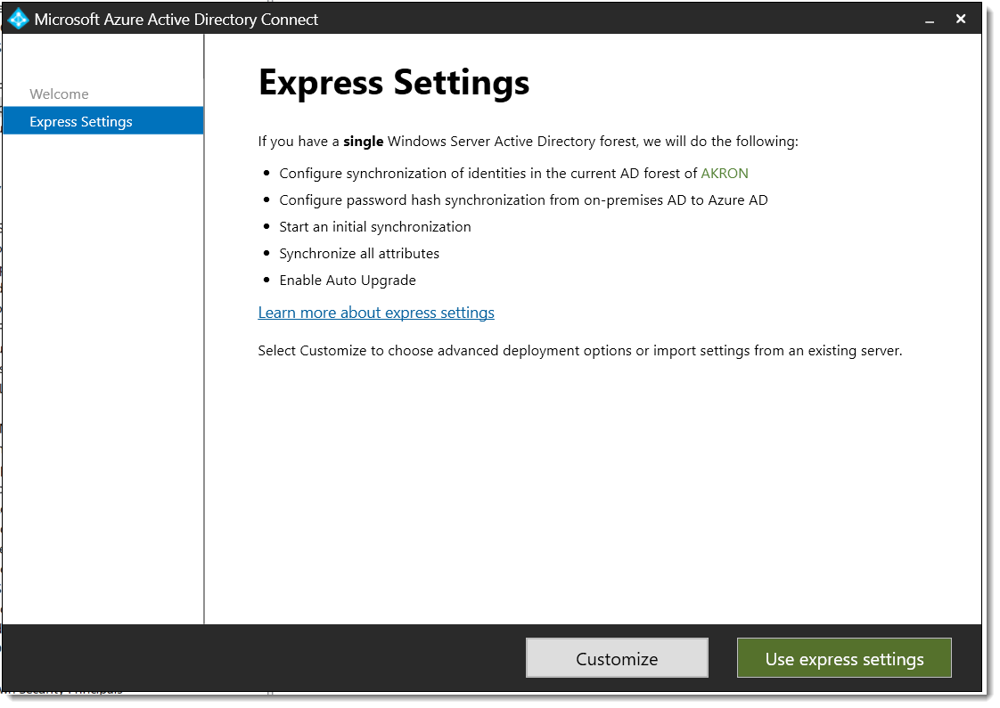

After it is finished, re-run and enable Hybrid Join

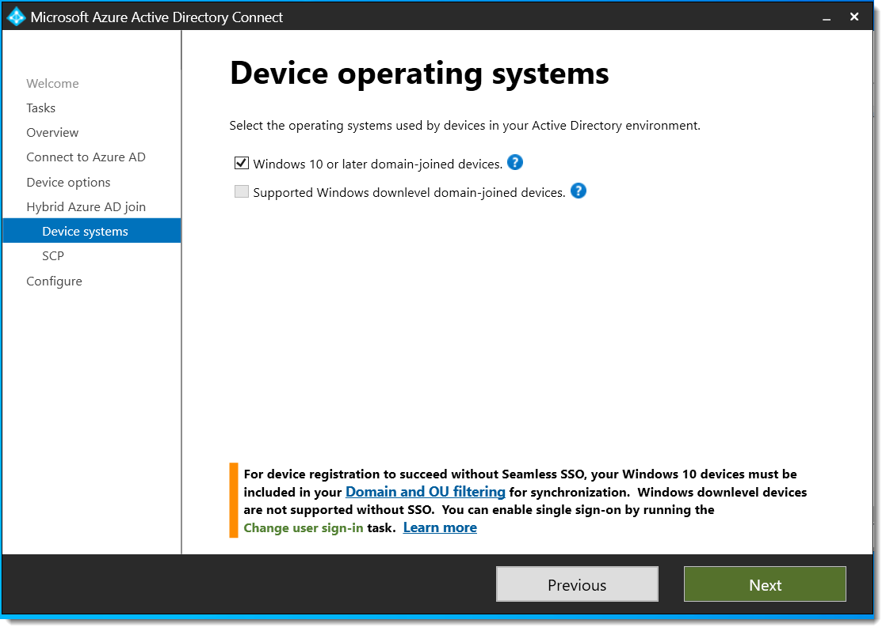


### Enable Group Writeback
On the AzureAD Connect server, run the following commands to enable [Group Writeback](https://learn.microsoft.com/en-us/azure/active-directory/hybrid/connect/how-to-connect-group-writeback-enable) in Windows PowerShell
``` PowerShell
Set-ADSyncScheduler -SyncCycleEnabled $false
Set-ADSyncAADCompanyFeature -GroupWritebackV2 $true
Set-ADSyncScheduler -SyncCycleEnabled $true
Start-ADSyncSyncCycle -PolicyType Initial
```


### Hybrid Cloud Trust
Create [AzureAD Kerberos Server](https://docs.microsoft.com/en-us/azure/active-directory/authentication/howto-authentication-passwordless-security-key-on-premises#example-4-prompt-for-cloud-credentials-using-modern-authentication)

``` powershell
# Specify the on-premises Active Directory domain. A new Azure AD
# Kerberos Server object will be created in this Active Directory domain.
$domain = "contoso.com"

# Enter a UPN of an Azure Active Directory global administrator
$userPrincipalName = "admin@contoso.com"

# Enter a domain administrator username and password.
$domainCred = Get-Credential

# Create the new Azure AD Kerberos Server object in Active Directory
# and then publish it to Azure Active Directory.
# Open an interactive sign-in prompt with given username to access the Azure AD.
Set-AzureADKerberosServer -Domain $domain -UserPrincipalName $userPrincipalName -DomainCredential $domainCred

# Verify server
Get-AzureADKerberosServer -Domain $domain -DomainCredential $domainCred -UserPrincipalName $userPrincipalName

Id                 : 17530
UserAccount        : CN=krbtgt_AzureAD,CN=Users,DC=contoso,DC=com
ComputerAccount    : CN=AzureADKerberos,OU=Domain Controllers,DC=contoso,DC=com
DisplayName        : krbtgt_17530
DomainDnsName      : contoso.com
KeyVersion         : 27591
KeyUpdatedOn       : 10/13/2022 9:23:43 PM
KeyUpdatedFrom     : CONTOSO-DC-01.contoso.com
CloudDisplayName   : krbtgt_17530
CloudDomainDnsName : contoso.com
CloudId            : 17530
CloudKeyVersion    : 27591
CloudKeyUpdatedOn  : 10/13/2022 9:23:43 PM
CloudTrustDisplay  :
```


## [Entra](https://entra.microsoft.com/)
### Authentication Settings

- [Enable Self Service Password Reset](https://entra.microsoft.com/#view/Microsoft_AAD_IAM/PasswordResetMenuBlade/~/Properties/)
- Enable FIDO2, Authenticator, Temporary Access Pass in [Authentication Methods](https://entra.microsoft.com/#view/Microsoft_AAD_IAM/AuthenticationMethodsMenuBlade/~/AdminAuthMethods)
- Disable verification options in the [legacy MFA settings portal](https://account.activedirectory.windowsazure.com/usermanagement/mfasettings.aspx)
  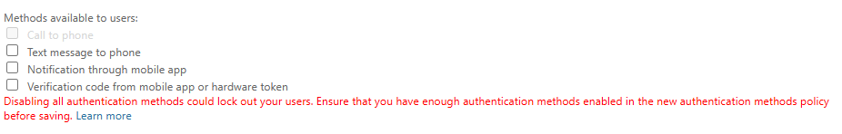
- Disable Authentication methods in [SSPR Authentication Methods](https://entra.microsoft.com/#view/Microsoft_AAD_IAM/PasswordResetMenuBlade/~/AuthenticationMethods/fromNav/Identity)
  
- [Migrate to Converged Authentication Methods Policy](https://entra.microsoft.com/#view/Microsoft_AAD_IAM/AuthenticationMethodsMenuBlade/~/AdminAuthMethods)
   

### [User Settings](https://entra.microsoft.com/#view/Microsoft_AAD_UsersAndTenants/UserManagementMenuBlade/~/UserSettings/menuId/)

- Toggle Off
	- Users can register Applications
	- Show keep user signed in
- Toggle On
	- Restrict non-admin users from creating tenants
	- Restrict access to Entra ID administration portal
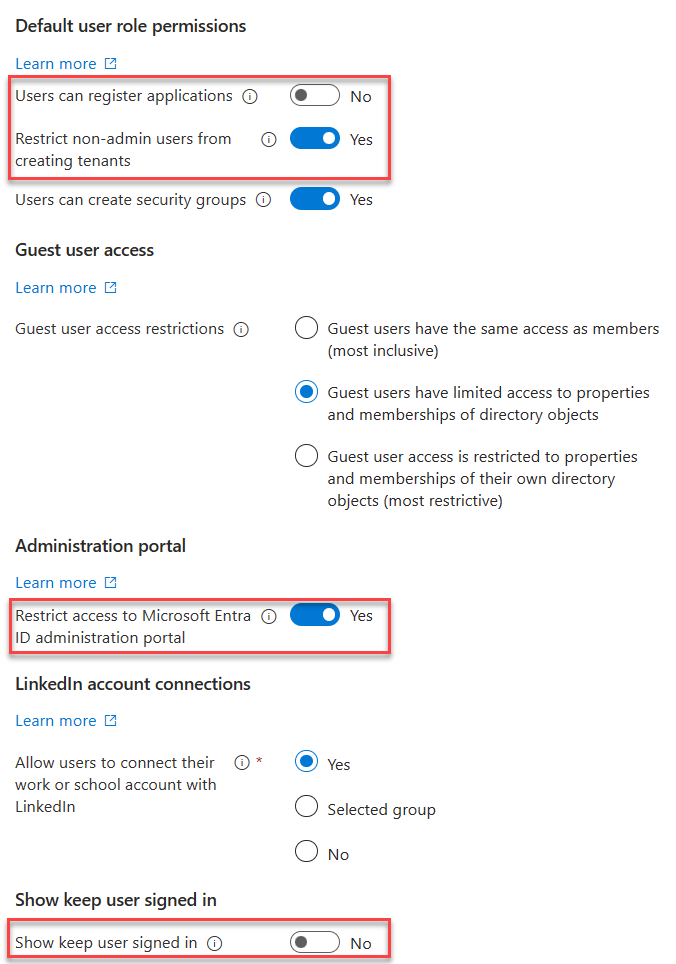

### [User Feature Settings](https://entra.microsoft.com/#view/Microsoft_AAD_IAM/FeatureSettingsBlade)

- Select All for Users can use preview features for My Apps

### [Device Settings](https://entra.microsoft.com/#view/Microsoft_AAD_Devices/DevicesMenuBlade/~/DeviceSettings/menuId/Overview)

#### [EntraID Local Admin Password Solution](https://portal.azure.com/#view/Microsoft_AAD_Devices/DevicesMenuBlade/~/DeviceSettings/menuId~/null)


>[!tip] [LAPS docs](https://learn.microsoft.com/en-us/mem/intune/protect/windows-laps-overview)

#### [Enterprise State Roaming](https://portal.azure.com/#view/Microsoft_AAD_Devices/DevicesMenuBlade/~/RoamingSettings/menuId~/null)
Enable Enterprise State Roaming


### Identity Protection

#### Multifactor authentication registration policy

- Create a AAD group called Service Accounts, add the AzureAD Connect sync account
- Enable the policy, targeting all users and excluding 

### Diagnostic Settings
[:octicons-link-24: Portal](https://portal.azure.com/#view/Microsoft_AAD_IAM/ActiveDirectoryMenuBlade/~/DiagnosticSettings)    [:octicons-book-16: Docs](https://learn.microsoft.com/en-us/azure/azure-monitor/essentials/diagnostic-settings)

- Enable all diagnostic settings to log to your Sentinel's log analytics workspace
  
  
### Global Secure Access

https://entra.microsoft.com/#view/Microsoft_Azure_Network_Access/Welcome.ReactView


## [Intune](https://endpoint.microsoft.com/#home)

### [Tenant Administration](https://endpoint.microsoft.com/#view/Microsoft_Intune_DeviceSettings/TenantAdminMenu/~/tenantStatus)

### [Defender for Endpoint Connector](https://intune.microsoft.com/#view/Microsoft_Intune_DeviceSettings/TenantAdminConnectorsMenu/~/windowsDefenderATP)
- Enable compliance policy evaluation for all platforms
- Enable app sync
- Enable App protection policy evaluation


### [Devices](https://endpoint.microsoft.com/#view/Microsoft_Intune_DeviceSettings/DevicesMenu/~/overview)

#### [Enroll Devices](https://endpoint.microsoft.com/#view/Microsoft_Intune_DeviceSettings/DevicesMenu/~/enrollDevices)

##### [Windows Enrollment](https://intune.microsoft.com/#view/Microsoft_Intune_DeviceSettings/DevicesWindowsMenu/~/windowsEnrollment)

**Windows enrollment - Automatic Enrollment**  

**[Windows enrollment - Autopilot deployment Profiles](https://intune.microsoft.com/#view/Microsoft_Intune_Enrollment/AutopilotDeploymentProfiles.ReactView)**

Create a new Autopilot deployment profile

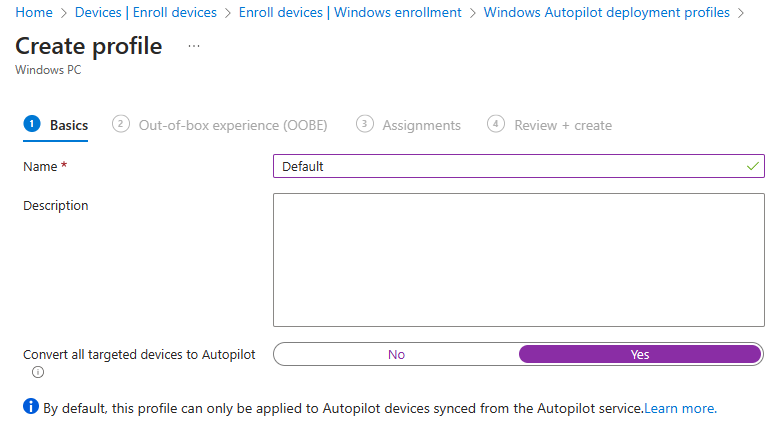


##### [iOS Enrollment](https://intune.microsoft.com/#view/Microsoft_Intune_DeviceSettings/DevicesIosMenu/~/iosEnrollment)

**Configure Apple MDM Push Certificate**
Instructions: [Get an Apple MDM Push certificate for Intune | Microsoft Learn](https://learn.microsoft.com/en-us/mem/intune/enrollment/apple-mdm-push-certificate-get)


**Enrollment Profile**
Configure an enrollment profile
[Enrollment type profiles - Microsoft Intune admin center](https://intune.microsoft.com/#view/Microsoft_Intune_Enrollment/UserInitiatedEnrollmentProfilesListBlade)

Create a profile that allows user choice of type of device (corporate vs user), target all users.


##### [Android Enrollment](https://intune.microsoft.com/#view/Microsoft_Intune_DeviceSettings/DevicesAndroidMenu/~/androidEnrollment)
Instructions: [Android device enrollment guide for Microsoft Intune | Microsoft Learn](https://learn.microsoft.com/en-us/mem/intune/fundamentals/deployment-guide-enrollment-android#enable-enrollment-of-android-for-work-devices)

Managed Google Play Account Linking


### [Apps](https://endpoint.microsoft.com/#view/Microsoft_Intune_DeviceSettings/AppsMenu/~/overview)

#### [Windows](https://endpoint.microsoft.com/#view/Microsoft_Intune_DeviceSettings/AppsWindowsMenu/~/windowsApps)

Add app -> Microsoft 365 Apps for Windows 10 and Later. Assign to all devices.


#### iOS
[:octicons-link-24: Portal](https://intune.microsoft.com/#view/Microsoft_Intune_DeviceSettings/AppsIosMenu/~/iosApps)
[:octicons-book-16: Docs](https://learn.microsoft.com/en-us/mem/intune/apps/apps-add)

##### Defender for Endpoint on iOS


### [Endpoint security](https://endpoint.microsoft.com/#view/Microsoft_Intune_Workflows/SecurityManagementMenu/~/overview)

#### [Endpoint detection and response](https://endpoint.microsoft.com/#view/Microsoft_Intune_Workflows/SecurityManagementMenu/~/edr)

Create a new policy targeting Windows 10,11 and Server. Target all devices.

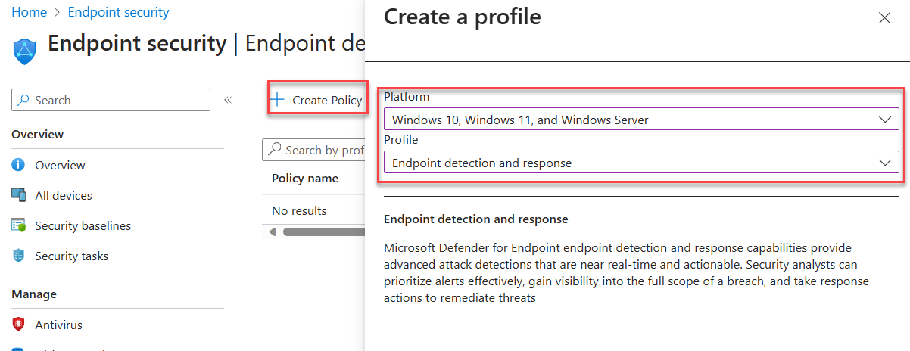


#### [Security Baselines](https://endpoint.microsoft.com/#view/Microsoft_Intune_Workflows/SecurityManagementMenu/~/securityBaselines)

Create a new Microsoft Defender for Endpoint Baseline policy and target all devices.

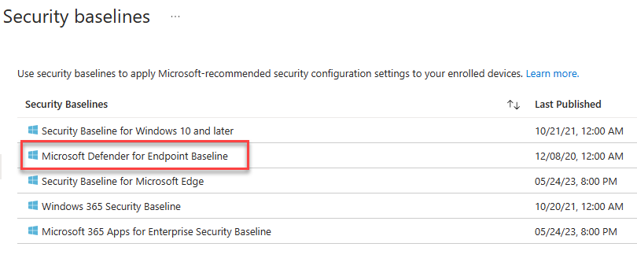

#### [Account Protection](https://endpoint.microsoft.com/#view/Microsoft_Intune_Workflows/SecurityManagementMenu/~/accountprotection)

After enabling LAPS in Entra, create a Windows LAPS profile and apply to all devices.


## [M365 Defender](https://security.microsoft.com/)

### Email & collaboration

[Policies & Rules -> Threat Policies -> Preset Security Configurations](https://security.microsoft.com/presetSecurityPolicies)

Enable Standard Protection Preset Policies.


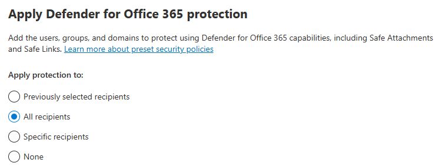


### MDCA
In the Defender Portal, go to [Settings -> Cloud Apps](https://security.microsoft.com/cloudapps/settings?tabid=about)

#### System
##### [Preview Features](https://security.microsoft.com/cloudapps/settings?tabid=previewFeatures)
- Toggle Enable
##### [IP address Ranges](https://security.microsoft.com/cloudapps/settings?tabid=ipRanges)
- If you have IP Ranges as Trusted Named Locations in EID, add them as Custom IP Address Ranges in MDCA with the category of Corporate
  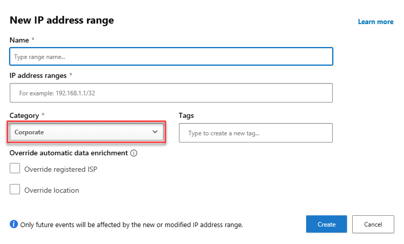


#### Cloud Discovery

##### [Defender for Endpoint](https://security.microsoft.com/cloudapps/settings?tabid=app-control)
- Enforce App Access with Defender for Endpoint
  

##### [User Enrichment](https://security.microsoft.com/cloudapps/settings?tabid=discovery-userEnrichment)
- Enable User Enrichment   

#### Information Protection

##### [Microsoft Information Protection](https://security.microsoft.com/cloudapps/settings?tabid=security)
- Enable automatically scan new files
- Enable scanning protected files. You'll need to go through the OAUTH grant process.
  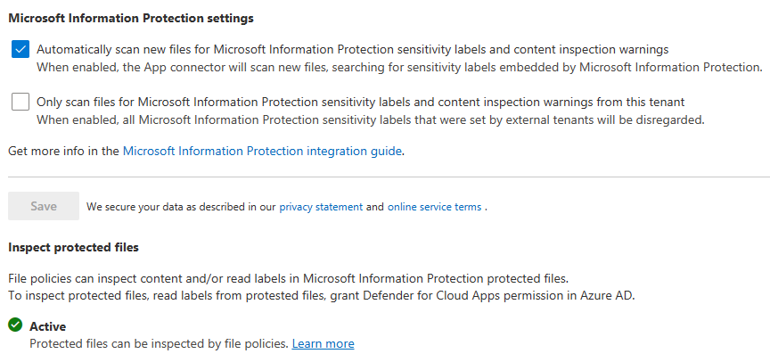

##### [Files](https://security.microsoft.com/cloudapps/settings?tabid=files)
- Enable file monitoring
  

#### App governance

##### [Service Status](https://security.microsoft.com/cloudapps/settings?tabid=activateAppG)
- Turn on app governance
  

#### Connected Apps

##### [App Connectors](https://security.microsoft.com/cloudapps/settings?tabid=appConnectors)
- Hit Connect an app, choose Microsoft 365 from the list. Select all options.


#### [SIEM Agents](https://security.microsoft.com/cloudapps/settings?tabid=siemAgents)

- Add the Azure Sentinel integration


### MDE
In the Defender Portal, go to [Settings -> Endpoints](https://security.microsoft.com/securitysettings/endpoints/integration)

#### Advanced Features
Set the features configured below


### Defender for Identity (MDI)

#### General
In the Defender Portal, go to [Settings -> Identities](https://security.microsoft.com/settings/identities)

##### Sensors
Click +Add Sensor, and download the installer and copy the Access key


Install the sensor on all DCs in AD. Use the access key when prompted by the installer.


After installing, configure the Active Directory requirements listed below.

#### AD Configuration

- [Configure Event Collection via GPO](https://learn.microsoft.com/en-us/defender-for-identity/configure-windows-event-collection)
- Configure Group Managed Service Account account
	- On the first DC
		- Create root KDS key
		  ``` powershell
		 Add-KdsRootKey -EffectiveTime ((get-date).addhours(-10))
		 ```
		- Purge kerberos tickets
		  ``` powershell
		  klist purge -li 0x3e7
```
		- Create the gMSA
		  ``` powershell
		 New-ADServiceAccount accountname -PrincipalsAllowedToRetrieveManagedPassword "Domain Controllers" -DNSHostName accountname.domain.contoso.com
```
		- Install the gMSA on the DC
		  ``` powershell
		  Install-ADServiceAccount -Identity 'accountname'
```
	- On the other DCs, purge kerberos tickets and install the service account
	- Add the gMSA in the portal
	  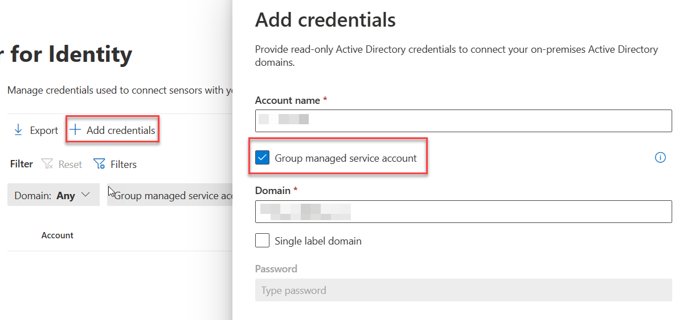


## Microsoft Purview

### Sensitivity Labels

#### Enable labeling for Protected content & PDFs
- [Enable Sensitivity Labels for Protected Content](https://learn.microsoft.com/en-us/purview/sensitivity-labels-sharepoint-onedrive-files#use-the-microsoft-purview-compliance-portal-to-enable-support-for-sensitivity-labels)
- [Enable labeling support for PDFs](https://learn.microsoft.com/en-us/purview/sensitivity-labels-sharepoint-onedrive-files#adding-support-for-pdf)

With the [SharePoint Module](https://www.powershellgallery.com/packages/Microsoft.Online.SharePoint.PowerShell) in PowerShell 5

```powershell
connect-sposervice -url 'https://<tenant>-admin.sharepoint.com/'
Set-SPOTenant -EnableAIPIntegration $true
Set-SPOTenant -EnableSensitivityLabelforPDF $true
```

#### Enable Labeling for Containers
In a fresh tenant, there will not be any EntraID group settings configured, so those [need to be created](https://learn.microsoft.com/en-us/azure/active-directory/enterprise-users/groups-settings-cmdlets). After that, you can [enable the label sync](https://learn.microsoft.com/en-us/purview/sensitivity-labels-teams-groups-sites#how-to-enable-sensitivity-labels-for-containers-and-synchronize-labels).

With the [AzureADPreview module](https://www.powershellgallery.com/packages/AzureADPreview) in Windows PowerShell (PS5)

```PowerShell
Connect-AzureAd
$TemplateId = (Get-AzureADDirectorySettingTemplate | where { $_.DisplayName -eq "Group.Unified" }).Id
$Template = Get-AzureADDirectorySettingTemplate | where -Property Id -Value $TemplateId -EQ
$setting = $Template.CreateDirectorySetting()
$setting["EnableMIPLabels"] = "True"
New-AzureADDirectorySetting -DirectorySetting $Setting
```

Then, with the [ExchangeOnlineManagement module](https://www.powershellgallery.com/packages/ExchangeOnlineManagement) in PS5/PS7+

```PowerShell
Connect-IPPSSession
Execute-AzureAdLabelSync
```

#### Enable co-authoring for Encrypted Files
This can be [done in the portal](https://learn.microsoft.com/en-us/purview/sensitivity-labels-coauthoring#how-to-enable-co-authoring-for-files-with-sensitivity-labels), or via PowerShell.

With the [ExchangeOnlineManagement module](https://www.powershellgallery.com/packages/ExchangeOnlineManagement) in PS5/PS7+

```PowerShell
Connect-IPPSSession
Set-PolicyConfig -EnableLabelCoauth:$true
```

### DLP

#### Endpoint DLP

##### Settings
[:octicons-link-24: Portal](https://compliance.microsoft.com/datalossprevention/endpointdlpsettings)
[:octicons-book-16: Docs](https://learn.microsoft.com/en-us/purview/dlp-configure-endpoint-settings)

In Settings, change the following:
- Advanced classification scanning and protection: `On`

### MIP Scanner
[:octicons-link-24: Portal](https://compliance.microsoft.com/compliancesettings/scanner_onboarding)
[:octicons-book-16: Docs](https://learn.microsoft.com/en-us/purview/deploy-scanner)

Prerequisites
- Service account in AD, exclude from MFA registration and CAs
- SQL server for the scanner, as well as a windows server.

Deployment
1. Create a Scanner Cluster
   
2. Create a Content Scan Job. Be sure to disable any of the auto options - this will just be for scanning.
   

